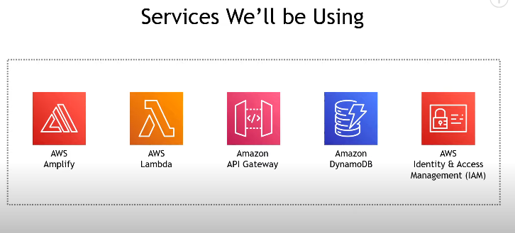

# Math_Power_Webapp_hosted_using_AWS
A Small Project Built by me using AWS services.
A simple web application Built using AWS, which calculates the value of power of a base.
#AWS Services Used:

-> AWS Amplify
-> AWS API Gateway
-> AWS Lambda
-> AWS Dynamodb
-> AWS IAM.

